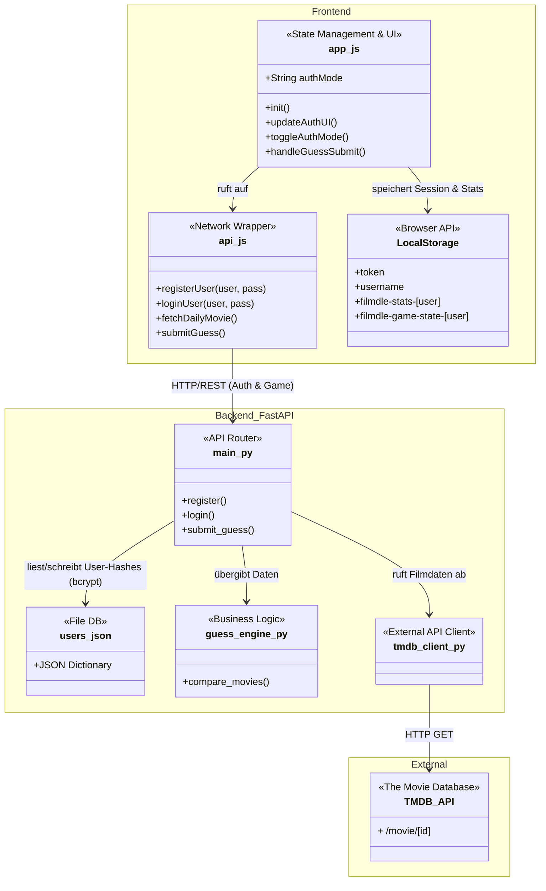

# Filmdle - UML

## 1.UML-Diagramm (Architektur)

UML-Diagramm für das Projekt: Filmdle

```mermaid
classDiagram
    direction TB

    namespace Frontend {
        class app_js {
            <<State Management & UI>>
            +String authMode
            +init()
            +updateAuthUI()
            +toggleAuthMode()
            +handleGuessSubmit()
        }
        
        class api_js {
            <<Network Wrapper>>
            +registerUser(user, pass)
            +loginUser(user, pass)
            +fetchDailyMovie()
            +submitGuess()
        }
        
        class LocalStorage {
            <<Browser API>>
            +token
            +username
            +filmdle-stats-[user]
            +filmdle-game-state-[user]
        }
    }

    namespace Backend_FastAPI {
        class main_py {
            <<API Router>>
            +register()
            +login()
            +submit_guess()
        }
        
        class users_json {
            <<File DB>>
            +JSON Dictionary
        }
        
        class guess_engine_py {
            <<Business Logic>>
            +compare_movies()
        }
        
        class tmdb_client_py {
            <<External API Client>>
        }
    }

    namespace External {
        class TMDB_API {
            <<The Movie Database>>
            + /movie/[id]
        }
    }

    %% Frontend interne Beziehungen
    app_js --> api_js : ruft auf
    app_js --> LocalStorage : speichert Session & Stats

    %% Frontend-Backend Kommunikation
    api_js --> main_py : HTTP/REST (Auth & Game)

    %% Backend interne Beziehungen
    main_py --> users_json : liest/schreibt User-Hashes (bcrypt)
    main_py --> tmdb_client_py : ruft Filmdaten ab
    main_py --> guess_engine_py : übergibt Daten

    %% Externe Aufrufe
    tmdb_client_py --> TMDB_API : HTTP GET
```

---

